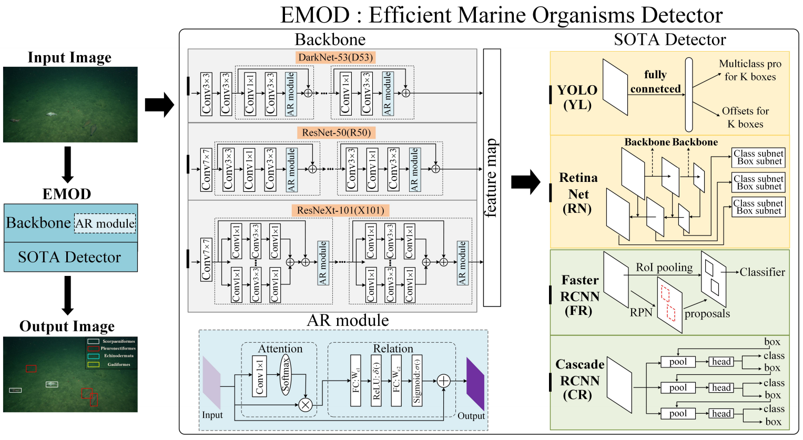

# Efficient Marine Organism Detector (EMOD) for Marine Video Surveillance

We release the code of Efficient Marine Organism Detector (EMOD) in our papers:  
- Detecting Marine Organisms via Joint Attention-Relation Learning for Marine Video Surveillance. (IEEE Journal of Oceanic Engineering, 2022, DOI: [10.1109/JOE.2022.3162864](https://doi.org/10.1109/JOE.2022.3162864) (DOI currently unavailable))
- Detecting Organisms for Marine Video Surveillance. (Global OCEANS 2020, DOI: [10.1109/IEEECONF38699.2020.9389458](https://doi.org/10.1109/IEEECONF38699.2020.9389458))

```
@inproceedings{shi2020detecting,
  title={Detecting Organisms for Marine Video Surveillance},
  author={Shi, Zhensheng and Guan, Cheng and Cao, Liangjie and Li, Qianqian and Liang, Ju and Guo, Zonghui and Gu, Zhaorui and Zheng, Haiyong and Zheng, Bing},
  booktitle={Global OCEANS 2020: Singapore--US Gulf Coast},
  pages={1--7},
  year={2020},
  organization={IEEE}
}
```

## Introduction

We design an Efficient Marine Organism Detector (EMOD) for high-resolution marine video surveillance to detect organisms and surveil marine environments in a real-time and fast fashion. We also propose a novel Attention-Relation (AR) module to explore joint Attention-Relation in CNNs for marine organism detection. This code is based on the [mmdetection](https://github.com/open-mmlab/mmdetection) codebase (v2.13.0). 

<div align="center">
   
</div>

## Requirements

- Linux or macOS (Windows is in experimental support)
- Python 3.6+
- PyTorch 1.3+
- CUDA 9.2+ (If you build PyTorch from source, CUDA 9.0 is also compatible)
- GCC 5+
- [MMCV](https://mmcv.readthedocs.io/en/latest/#installation)

## Datasets

#### HabCam, MOUSS and MBARI.
- Contact dataset provider, and download the datasets and annotations: [CVPR 2018 Workshop](https://www.viametoolkit.org/cvpr-2018-workshop-data-challenge/challenge-data-description/) or [CVPR 2019 Workshop](https://www.aamvem.com/). 
- Put all images and annotation files to $EMOD/data folder.

## Running

- To train a FR-R50 detector on HABCAM dataset, you can run the script:

  ```
  CUDA_VISIBLE_DEVICES=0,1 PORT=29500 tools/dist_train.sh configs-emod/FR/FR_R50_FPN_HABCAM_SP1.py 2
  ```
  You can also set the variables (CONFIG_FILE, GPU_NUM) in [scripts/run_habcam.sh](scripts/run_habcam.sh), and then run the script:

  ```
  bash scripts/run_habcam.sh
  ```
  
## Models
We will provide the models and results later.

## Acknowledgement
We really appreciate the contributors of following codebases.

- [open-mmlab/mmdetection](https://github.com/open-mmlab/mmdetection)
